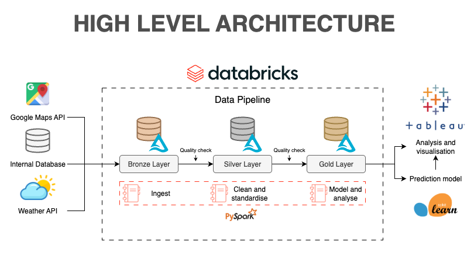

# Restaurant Data Warehouse

#### High level architecture 



#### Project documentation 
Check our project's [Style guide](docs/STYLEGUIDE.md) for better understanding of our code.
#### How to use :

1. Create your virtual environment :

```bash
python3 -m venv .venv
source .venv/bin/activate
```

2. Install requirements.txt :

```bash
pip install --upgrade pip
pip install -r requirements.txt
```
3. Generate and explore data :

```bash
python3 data_source/generate_raw_data.py
python3 data_source/explore.py
```

